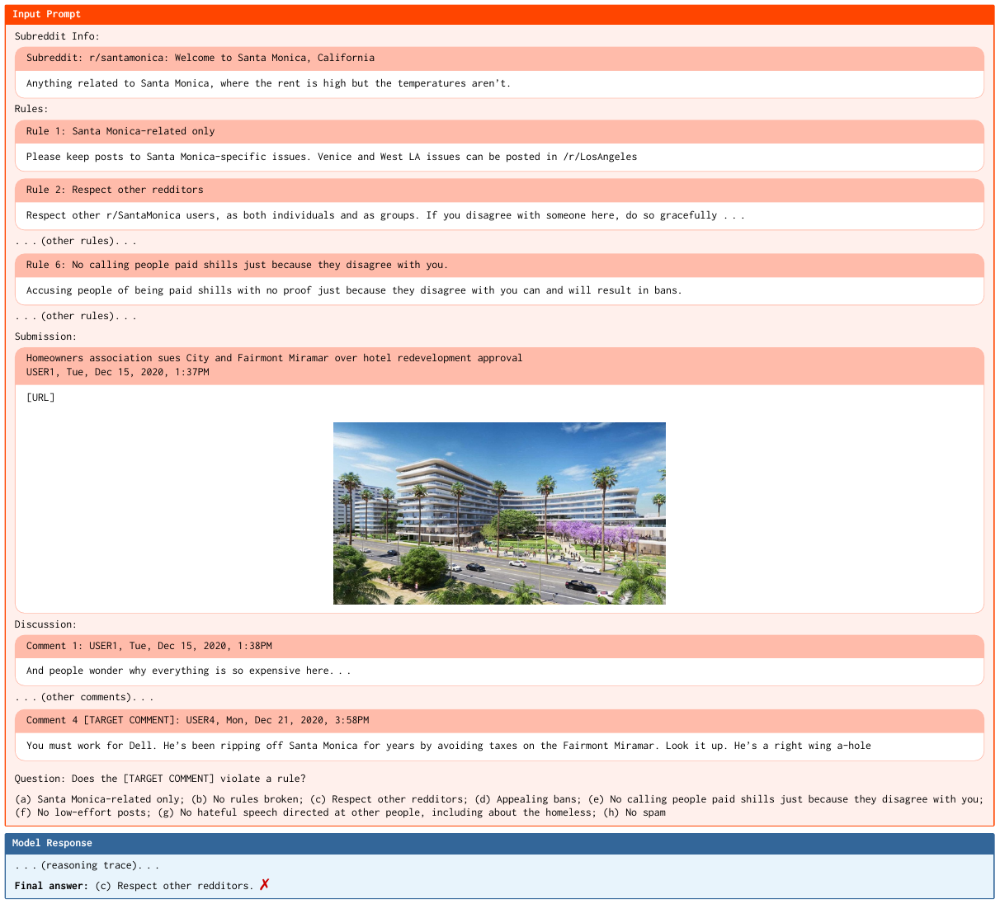
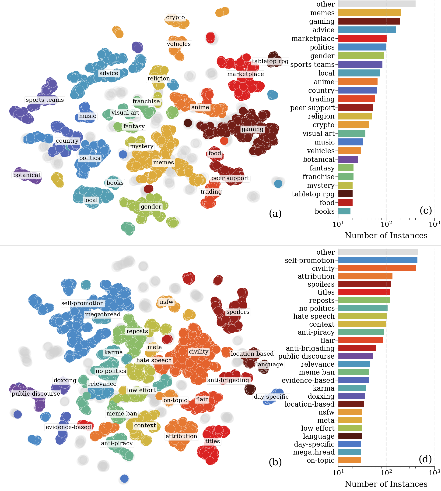
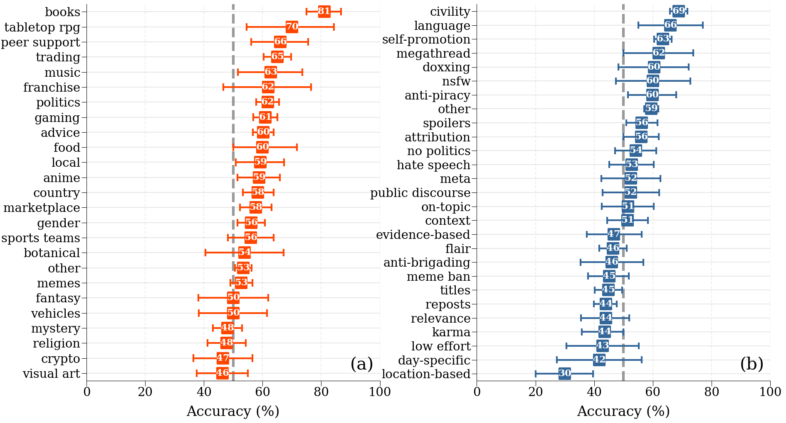

# PluRule

**PluRule** is a multilingual, multimodal benchmark for Reddit rule-violation
detection: 13,371 discussion instances drawn from the Pushshift archives,
each pairing a rule-violating thread with a compliant thread from the same
submission, labeled against the community's own rules.

This repository contains the full construction pipeline, the scripts used to
hydrate the released dataset from IDs, and the evaluation harness used in the
paper.

> **Paper:** *PLURULE: A Benchmark for Moderating Pluralistic Communities on
> Social Media* <!-- TODO: arXiv link when processing completes -->

<p align="center">
  
</p>

<p align="center"><em>
A <strong>PluRule</strong> example: GPT-5.2 (high reasoning) is given the
target comment with full context — subreddit description, rules, submission,
and discussion thread — and asked to pick which rule, if any, was violated.
The correct answer is (e); GPT-5.2 picks (c).
</em></p>

## At a glance

| Split | Instances | Comments | Images | Subreddits / Clusters | Rules / Clusters | Languages |
|---|---:|---:|---:|---:|---:|---:|
| Train | 9,155 | 51,968 | 2,077 | 861 / 25 | 1,336 / 27 | 9 |
| Val   | 1,382 |  7,631 |   376 | 537 / 25 |   586 / 27 | 9 |
| Test  | 2,834 | 13,076 | 1,190 | **1,989 / 25** | 2,039 / 27 | 9 |
| **Total** | **13,371** | **72,675** | **3,643** | **1,989 / 25** | **2,885 / 27** | **9** |

Every instance contains (a) a root-to-leaf discussion thread where a
moderator cited a rule on the leaf comment, (b) a compliant sibling thread
from the same submission, (c) the submission itself with any images, and
(d) the subreddit's full rule set.

## What it covers

<p align="center">
  
</p>

<p align="center"><em>
2D UMAP of (a) 1,989 subreddits and (b) 2,885 rules, colored by HDBSCAN
cluster. Grey points are unclustered ("other"). Right: distributions of the
13,371 instances across (c) 25 subreddit clusters and (d) 27 rule clusters.
</em></p>

## Main results

Accuracy (%) across models and context levels on the test set.
Numbers in parentheses show the delta from the previous row. Bold is
best per model. 95% CIs are within ±1.3% everywhere. The
"No rules broken" baseline is 50%.

| Context | 4B Inst. | 4B Think. | 8B Inst. | 8B Think. | 30B Inst. | 30B Think. | GPT-5.2 Low | GPT-5.2 High |
|---|:---|:---|:---|:---|:---|:---|:---|:---|
| Comment only                | **49.6** | 37.4     | **51.0** | 40.3     | 50.2     | 46.1     | 54.1     | 55.0     |
| + Discussion                | 49.2 <sub>(−0.4)</sub>     | 39.8 <sub>(+2.4)</sub>     | 50.7 <sub>(−0.3)</sub>     | 43.9 <sub>(+3.6)</sub>     | 51.0 <sub>(+0.8)</sub>     | 48.2 <sub>(+2.1)</sub>     | 55.3 <sub>(+1.2)</sub>     | 56.2 <sub>(+1.2)</sub>     |
| &nbsp;&nbsp;+ Submission    | 48.3 <sub>(−0.9)</sub>     | 44.9 <sub>(+5.1)</sub>     | 49.2 <sub>(−1.5)</sub>     | **47.2** <sub>(+3.3)</sub> | 51.1 <sub>(+0.1)</sub>     | 49.1 <sub>(+0.9)</sub>     | 56.8 <sub>(+1.5)</sub>     | 57.3 <sub>(+1.1)</sub>     |
| &nbsp;&nbsp;&nbsp;&nbsp;+ User    | 48.9 <sub>(+0.6)</sub>     | **45.0** <sub>(+0.1)</sub> | 50.0 <sub>(+0.8)</sub>     | 46.7 <sub>(−0.5)</sub>     | **52.4** <sub>(+1.3)</sub> | 49.4 <sub>(+0.3)</sub>     | **57.4** <sub>(+0.6)</sub> | **57.7** <sub>(+0.4)</sub> |
| &nbsp;&nbsp;&nbsp;&nbsp;&nbsp;&nbsp;+ Images | 48.4 <sub>(−0.5)</sub> | 45.0 <sub>(+0.0)</sub>    | 49.8 <sub>(−0.2)</sub>     | 44.9 <sub>(−1.8)</sub>     | 52.3 <sub>(−0.1)</sub>     | **49.5** <sub>(+0.1)</sub> | **57.4** <sub>(+0.0)</sub> | 57.6 <sub>(−0.1)</sub>     |

Even the best model (GPT-5.2 high reasoning with full context) only reaches
**57.7%** — less than 8 points above the trivial baseline. Adding context
(discussion thread, submission, user identifiers, images) helps by at most
2–3 points. Open-weight models (Qwen3-VL-Instruct / -Thinking) don't beat
baseline at all.

### Per-cluster breakdown (GPT-5.2 high reasoning, full context)

<p align="center">
  
</p>

<p align="center"><em>
Accuracy by (a) subreddit cluster and (b) rule cluster with 95% CI.
Dashed line is the 50% baseline. Universal violations (civility,
self-promotion) are solved well; context-dependent rules (low-effort,
evidence-based, relevance) fall below baseline.
</em></p>

## What do you want to do?

### ▶︎ Run the benchmark on the released dataset

Start here if you want to evaluate a model on PluRule.

1. Grab the three dehydrated split files from
   [huggingface.co/datasets/osome-iu/PluRule](https://hf.co/datasets/osome-iu/PluRule)
   and place them under `./data/`.
2. Follow **[`hydrate/README.md`](hydrate/README.md)** to fill in comments,
   submissions, and media from the Pushshift archives (~a few hours, no GPU).
3. Run your model through **[`eval/README.md`](eval/README.md)** — supports
   vLLM (Qwen-VL, LLaVA, Llama-Vision) and API models (Claude, GPT-4V) out
   of the box.

### ▶︎ Rebuild PluRule from scratch

Start here if you want to reproduce the dataset end to end, tweak
thresholds, or extend the pipeline.

Follow **[`pipeline/README.md`](pipeline/README.md)**. Budget 1–2 days and
multiple GPUs: embedding matcher (Qwen3-Embedding-8B), LLM judge
(Qwen3-30B-A3B-Instruct), and cluster labeler (Qwen3-30B-A3B-Thinking) are
all run locally via vLLM.

### ▶︎ Reproduce the human evaluation

See **[`eval/human_eval/`](eval/human_eval/)** for the Google Forms
annotation protocol used in Section 5.4 of the paper (96% overall
agreement with the pipeline's labels on a 100-instance audit).

## Install

```bash
git clone https://github.com/osome-iu/PluRule.git
cd PluRule

# Pick the env that matches your goal:
conda env create -f environment-hydrate.yml   # minimal, hydration only (no GPU)
conda env create -f environment-pipeline.yml  # end-to-end reconstruction (GPUs)
conda env create -f environment-eval.yml      # benchmark evaluation (GPU or API keys)
```

For API-model evaluation, copy `credentials/.env.template` to
`credentials/.env` and fill in your `OPENAI_API_KEY` / `ANTHROPIC_API_KEY`.

## Repo layout

```
PluRule/
├── hydrate/          # 3 scripts to reconstitute the released dataset
├── pipeline/         # end-to-end reconstruction from Pushshift (paper §5)
├── eval/             # benchmark evaluation harness
│   └── human_eval/   # human annotation reproduction
├── utils/            # shared helpers (zst I/O, Pushshift torrent, media, …)
├── config.py         # base paths + thresholds (edit before running)
├── credentials/      # API key templates (.env, Reddit, Google)
├── environment-hydrate.yml    # hydration-only conda env
├── environment-pipeline.yml   # reconstruction conda env
└── environment-eval.yml       # evaluation conda env
```

## Citing

```bibtex
@misc{plurule2025,
  title  = {PLURULE: A Benchmark for Moderating Pluralistic Communities
            on Social Media},
  author = {Kachwala, Zoher and Truong, Bao Tran and Muralidharan, Rasika and
            Kwak, Haewoon and An, Jisun and Menczer, Filippo},
  year   = {2025},
  note   = {arXiv preprint},
}
```
<!-- TODO: add arXiv ID / eprint field once processing completes -->

## License

Code in this repository is released under the **MIT License** — see
[`LICENSE`](LICENSE). The PluRule dataset itself is distributed separately on
HuggingFace under its own license; the underlying moderator comments and
submissions come from the publicly archived Pushshift Reddit corpus and are
bound by Reddit's terms of service.
